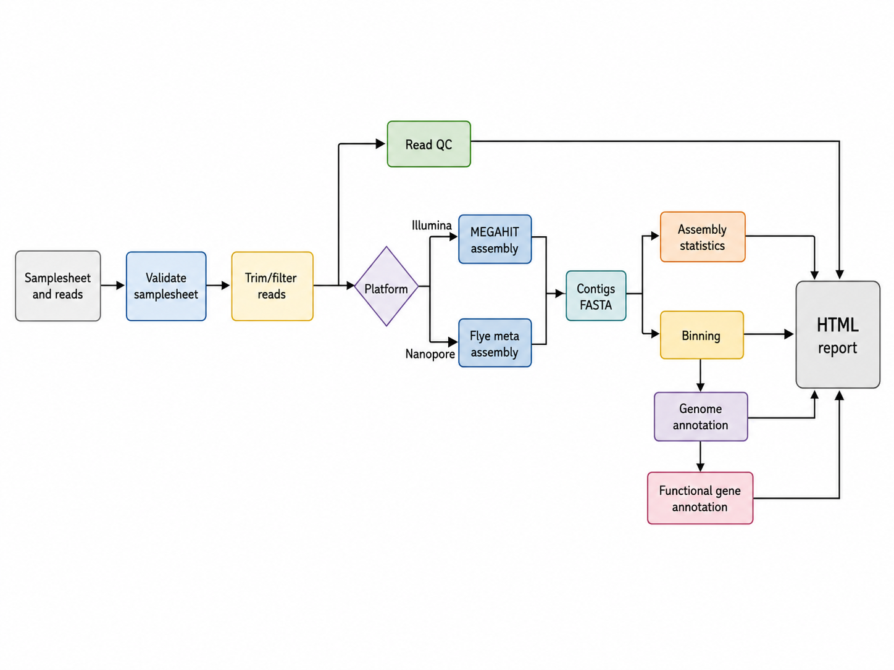

# HOMES_assembly

`HOMES_assembly` assembles Illumina and Oxford Nanopore reads for HOMES projects and can continue into MAG-style binning, genome annotation, and functional gene annotation. It is intended for shotgun datasets where local laptops may be too small for the actual assembly and annotation steps, so the workflow includes both local container profiles and server/HPC profiles.

## Platforms

| platform | default assembler | default downstream tools | main outputs |
| --- | --- | --- | --- |
| `illumina` | MEGAHIT | MetaBAT2, Prokka | trim/filter QC, contigs FASTA, bins, genome annotation, functional gene table, HTML report |
| `nanopore` | Flye meta mode | MetaBAT2, Prokka | trim/filter QC, contigs FASTA, bins, genome annotation, functional gene table, HTML report |

The current implementation performs one coassembly per run. The `assembly_group` samplesheet column is kept for future grouped coassemblies. The test profiles use lightweight native binning and annotation so the workflow can be validated without large databases or heavy containers; real runs can use `--binner metabat2` and `--annotation_tool prokka`.

## Workflow



The Mermaid source is also stored in [`figure/HOMES_assembly_workflow.mmd`](figure/HOMES_assembly_workflow.mmd).

## Test Commands

Use `-stub-run` first to validate the full Nextflow graph without running heavy assemblers, binners, or annotators:

```bash
nextflow run workflows/HOMES_assembly \
  -profile test_illumina,docker \
  --outdir results/HOMES_assembly_illumina_stub \
  -stub-run
```

```bash
nextflow run workflows/HOMES_assembly \
  -profile test_nanopore,docker \
  --outdir results/HOMES_assembly_nanopore_stub \
  -stub-run
```

Run the bundled tiny validation data with lightweight native binning and annotation:

```bash
nextflow run workflows/HOMES_assembly \
  -profile test_illumina,docker \
  --platform illumina \
  --assembler megahit \
  --outdir results/HOMES_assembly_illumina_test \
  -resume
```

```bash
nextflow run workflows/HOMES_assembly \
  -profile test_nanopore,docker \
  --platform nanopore \
  --assembler flye \
  --genome_size 20k \
  --outdir results/HOMES_assembly_nanopore_test \
  -resume
```

For real data with MAG-style downstream steps, use containers and keep the default `--binner metabat2 --annotation_tool prokka`:

```bash
nextflow run workflows/HOMES_assembly \
  -profile docker \
  --platform illumina \
  --assembler megahit \
  --binner metabat2 \
  --annotation_tool prokka \
  --input /path/to/illumina_samplesheet.csv \
  --outdir results/HOMES_assembly_illumina_MAGs \
  -resume
```

The bundled read files are tiny and are meant for workflow validation, not biological interpretation.

## Server/HPC

For SLURM:

```bash
nextflow run workflows/HOMES_assembly \
  -profile server_slurm \
  --platform nanopore \
  --assembler flye \
  --genome_size 100m \
  --input /path/to/nanopore_samplesheet.csv \
  --outdir /path/to/results/HOMES_assembly_nanopore \
  --server_queue normal \
  -resume
```

For PBS/Torque:

```bash
nextflow run workflows/HOMES_assembly \
  -profile server_pbs \
  --platform illumina \
  --assembler megahit \
  --input /path/to/illumina_samplesheet.csv \
  --outdir /path/to/results/HOMES_assembly_illumina \
  -resume
```

The server profiles enable Singularity and use Docker-hosted containers through Singularity. On a server with a site-level Nextflow config, you can combine that config with this workflow and override CPU, memory, time, queue, or container settings.

## Outputs

See [`docs/output.md`](docs/output.md).

## Samplesheet

See [`docs/usage.md`](docs/usage.md).
