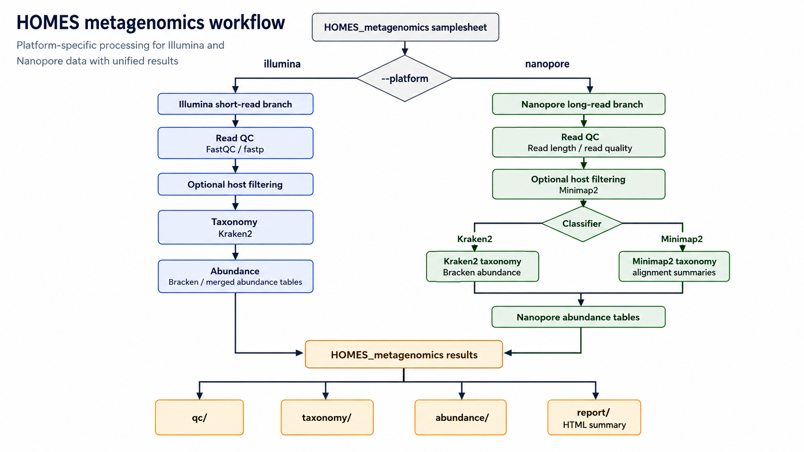

# HOMES_metagenomics

Unified shotgun metagenomics workflow entry point for HOMES (**Harmonizing 'Omics for Managing Environmental Systems**).

## Platform Design

- `--platform nanopore`: Nanopore FASTQ-oriented metagenomics, including read QC, Kraken2 classification, Kraken2-derived abundance tables, optional Bracken abundance estimation, and an HTML report.
- `--platform illumina`: short-read metagenomics, including read QC, host-removal-ready inputs, Kraken2 taxonomy and abundance outputs, optional Bracken estimation, merged abundance tables, and HTML reporting.

This HOMES workflow keeps the outward-facing output contract aligned across both platforms:

```text
results/HOMES_metagenomics/
  qc/
  taxonomy/
  abundance/
  report/
  pipeline_info/
```

The workflow validates input, writes HOMES-normalized QC/taxonomy/abundance outputs, and creates an HTML report. The module layout is designed so additional analysis methods can be added without changing the public output paths.

## Workflow Figure



## Samplesheet

Required columns:

```csv
sample,fastq_1,fastq_2,read_layout,host_ref
S1,/absolute/path/S1_R1.fastq.gz,/absolute/path/S1_R2.fastq.gz,paired,/absolute/path/human.fa
```

Column notes:

- `sample`: unique sample identifier.
- `fastq_1`: FASTQ path for single-end data, R1 for paired-end data, or Nanopore FASTQ.
- `fastq_2`: R2 FASTQ path for paired Illumina data; leave blank for Nanopore.
- `read_layout`: `paired` or `single` for Illumina; `single` for Nanopore.
- `host_ref`: optional host reference path used by host-removal modules.

Default test profiles use small public or synthetic test data:

- Illumina: `nf-core/test-datasets` taxprofiler paired-end FASTQ.
- Nanopore: a tiny synthetic FASTQ in `assets/testdata/nanopore/` for repository-based testing.

Tiny synthetic fallback files are kept under `assets/testdata/` for offline development:

```text
assets/testdata/
assets/testdata/nanopore/
```

## Standard-8 Test Runs

These commands use the bundled test samplesheets and the default `Standard-8` database preset. The first non-stub run downloads the selected Kraken2 database and taxonomy into the repository-level `db/` cache by default; later runs reuse the completed cache.

The test profiles set `download_databases = false` and `skip_taxonomy = true` to prevent accidental large downloads during lightweight tests. Full Standard-8 classification runs must explicitly set `--download_databases true --skip_taxonomy false`.

### Nanopore default dataset

```bash
STORE="${PWD}/db"

nextflow run workflows/HOMES_metagenomics \
  -profile test_nanopore,docker \
  --platform nanopore \
  --database_set Standard-8 \
  --download_databases true \
  --skip_taxonomy false \
  --store_dir "$STORE" \
  --outdir results/HOMES_metagenomics_nanopore_standard8 \
  -resume
```

The default Nanopore samplesheet is:

```text
assets/samplesheet_nanopore.csv
```

It points to the bundled tiny Nanopore FASTQ file in:

```text
assets/testdata/nanopore/
```

### Illumina default dataset

```bash
STORE="${PWD}/db"

nextflow run workflows/HOMES_metagenomics \
  -profile test_illumina,docker \
  --platform illumina \
  --database_set Standard-8 \
  --download_databases true \
  --skip_taxonomy false \
  --store_dir "$STORE" \
  --outdir results/HOMES_metagenomics_illumina_standard8 \
  -resume
```

The default Illumina samplesheet is:

```text
assets/samplesheet_illumina.csv
```

It points to remote nf-core taxprofiler FASTQ test data, so this run needs internet access.

## Lightweight Stub Tests

Use stub tests when you only want to validate the Nextflow graph and output structure without downloading databases or running real tools:

```bash
nextflow run workflows/HOMES_metagenomics \
  -profile test_nanopore,docker \
  --platform nanopore \
  --outdir results/HOMES_metagenomics_nanopore_stub \
  -stub-run \
  -resume
```

For a non-stub QC/report-only test that reads the bundled FASTQ but skips Kraken2, run the same test profile without `-stub-run`. The test profiles already set `--skip_taxonomy true`.

```bash
nextflow run workflows/HOMES_metagenomics \
  -profile test_illumina,docker \
  --platform illumina \
  --outdir results/HOMES_metagenomics_illumina_stub \
  -stub-run \
  -resume
```

## Run Your Own Data

Nanopore:

```bash
STORE="${PWD}/db"

nextflow run workflows/HOMES_metagenomics \
  -profile docker \
  --platform nanopore \
  --input /path/to/your_nanopore_samplesheet.csv \
  --database_set Standard-8 \
  --download_databases true \
  --skip_taxonomy false \
  --store_dir "$STORE" \
  --outdir results/HOMES_metagenomics_nanopore \
  -resume
```

Illumina:

```bash
STORE="${PWD}/db"

nextflow run workflows/HOMES_metagenomics \
  -profile docker \
  --platform illumina \
  --input /path/to/your_illumina_samplesheet.csv \
  --database_set Standard-8 \
  --download_databases true \
  --skip_taxonomy false \
  --store_dir "$STORE" \
  --outdir results/HOMES_metagenomics_illumina \
  -resume
```

## Output contract

```text
qc/
  <platform>.qc.summary.tsv
taxonomy/
  <platform>.taxonomy.tsv
  <sample>.kraken2.report
  <sample>.kraken2.output
abundance/
  <platform>.abundance.tsv
  <platform>.relative_abundance.tsv
  <sample>.bracken.tsv              # only when --bracken true
  <sample>.bracken.report           # only when --bracken true
report/
  HOMES_metagenomics.<platform>.report.html
pipeline_info/
  samplesheet.validated.csv
  homes_metagenomics.<platform>.plan.tsv
  versions.yml
```

## Database cache

Use an existing Kraken2/Bracken database:

```bash
nextflow run workflows/HOMES_metagenomics \
  -profile test_nanopore,docker \
  --kraken2_db /path/to/kraken2_db \
  --skip_taxonomy false \
  --outdir results/HOMES_metagenomics_nanopore
```

A Kraken2 database directory should already contain Kraken2-built files such as `hash.k2d`, `opts.k2d`, and `taxo.k2d`. HOMES searches below the provided directory, so archives that unpack into one nested database directory are supported. If Bracken abundance estimation is needed, add `--bracken true --bracken_read_length 150`; the database should also include matching Bracken files for the intended read length/kmer setup.

Or let HOMES download a database archive the first time and reuse it later:

```bash
nextflow run workflows/HOMES_metagenomics \
  -profile test_nanopore,docker \
  --database_set Standard-8 \
  --download_databases true \
  --skip_taxonomy false \
  --outdir results/HOMES_metagenomics_nanopore
```

Available preset names are `Standard-8`, `PlusPF-8`, `PlusPFP-8`, `ncbi_16s_18s`, `ncbi_16s_18s_28s_ITS`, `SILVA_138_1`, and `Greengenes2_plus`. If `--store_dir` is omitted, the default cache root is the repository-level `db/` directory, for example `/Users/kbian8/Documents/nextflow_work/HOMES/db` in your local checkout. This directory is intentionally ignored by Git.

Each run writes the resolved paths and status:

```text
pipeline_info/database_info.tsv
```

The status is `downloaded` on the first completed preset download and `reused` after that. See [docs/database.md](docs/database.md).

## Custom References and Taxonomy

For the current Kraken2-first branch, a custom FASTA alone is not enough for taxonomic classification. Provide a built Kraken2 database:

```bash
nextflow run workflows/HOMES_metagenomics \
  -profile docker \
  --platform nanopore \
  --input /path/to/samplesheet.csv \
  --kraken2_db /path/to/kraken2_db \
  --taxonomy /path/to/taxdump_or_taxonomy_archive \
  --outdir results/HOMES_metagenomics_custom_db \
  -resume
```

For a future Minimap2/custom FASTA branch, provide:

```bash
--reference /path/to/reference.fasta
--ref2taxid /path/to/ref2taxid.tsv
--taxonomy /path/to/taxdump_or_taxonomy_archive
```

The `ref2taxid.tsv` maps sequence IDs from the FASTA to NCBI taxids. A simple two-column format is recommended:

```text
sequence_id	taxid
contig_001	562
contig_002	1280
```

The taxonomy file or archive is needed to translate taxids into names and lineages. NCBI taxdump-style files usually include:

```text
nodes.dmp
names.dmp
merged.dmp
delnodes.dmp
```

For host filtering only, `host_ref` in the samplesheet can be a host FASTA and does not need taxids:

```csv
sample,fastq_1,fastq_2,read_layout,host_ref
S1,/path/S1.fastq.gz,,single,/path/host.fa
```

## Nanopore module mapping

The Nanopore implementation should map HOMES parameters to long-read metagenomics concepts:

- `fastq_1` / `--fastq`: Nanopore FASTQ input.
- `host_ref` / `--exclude_host`: reserved for optional host removal.
- `--classifier kraken2`: current taxonomic classification mode.
- `--database_set`, `--kraken2_db`: database selection.
- `--taxonomic_rank`: abundance rank, default species.
- `--bracken true --bracken_read_length <length>`: optional Bracken abundance estimation when the database supports it.
- HTML report includes QC, taxonomy composition, abundance, and diversity summary.

## Illumina module mapping

The Illumina implementation should map HOMES parameters to short-read metagenomics concepts:

- samplesheet rows become HOMES short-read metagenomics inputs.
- QC starts with FastQC and preprocessing can use fastp.
- host filtering can be implemented with Bowtie2/BWA/minimap2-compatible host references.
- Kraken2 produces taxonomy reports and default rank-level abundance tables.
- Bracken can estimate rank-level abundance from Kraken2 reports when `--bracken true`.
- Taxpasta-compatible tables provide merged count and relative abundance outputs.
- MultiQC inputs are summarized into the HOMES HTML report.
